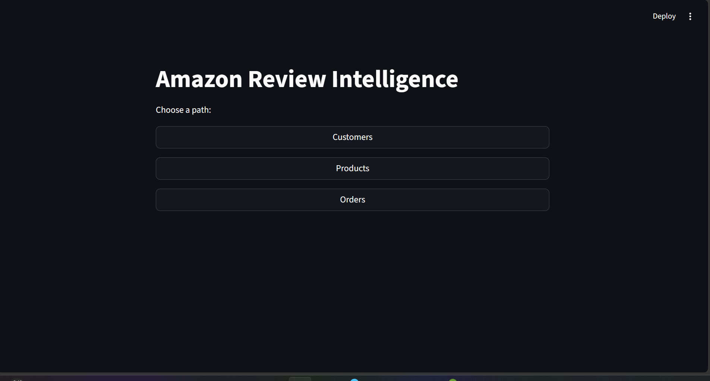

# Amazon Review Intelligence

## Summary
This project is a database application that analyzes product sales and customer order activity using an Amazon-style dataset. The system stores information about customers, products, orders, payments, categories, and reviews. A Streamlit dashboard is used to display the data and generate visualizations such as product sales trends and order status distribution.

The goal of the project is to demonstrate database design, data loading, and data analysis through a simple interactive application.

---
## ER Diagram (Text Form)

    CUSTOMER {
        int customer_id PK
        string full_name NOT_NULL
        string email NOT_NULL
        string phone OPTIONAL
        date created_at
    }

    PRODUCT {
        int product_id PK
        string product_name NOT_NULL
        decimal price NOT_NULL
        int stock_quantity
    }

    CATEGORY {
        int category_id PK
        string category_name NOT_NULL
    }

    ORDER {
        int order_id PK
        int customer_id FK  // → CUSTOMER.customer_id
        date order_date NOT_NULL
        string status
        decimal total_amount
    }

    PAYMENT {
        int payment_id PK
        int order_id FK UNIQUE  // → ORDER.order_id (enforces 1:1)
        string payment_method NOT_NULL
        decimal amount NOT_NULL
        datetime payment_date
    }

    REVIEW {
        int review_id PK
        int customer_id FK  // → CUSTOMER.customer_id
        int product_id FK   // → PRODUCT.product_id
        int rating NOT_NULL
        string review_text OPTIONAL
        date review_date
    }

    ORDER_ITEM {
        int order_id PK FK   // → ORDER.order_id
        int product_id PK FK // → PRODUCT.product_id
        int quantity NOT_NULL
        decimal unit_price NOT_NULL
    }

    PRODUCT_CATEGORY {
        int product_id PK FK   // → PRODUCT.product_id
        int category_id PK FK  // → CATEGORY.category_id
    }

## How to Use This Repository

Step 1: Create the database

Run the SQL file to create the database schema and tables.

SOURCE create_db.sql;

---

Step 2: Load the sample data

Run the Python data loader to populate the tables using the CSV files.

python dataload.py

---

Step 3: Add your database credentials

Open **app.py** and update the database connection information.

Find this section:

def connect_db():
    return mysql.connector.connect(
        host="localhost",
        user="root",
        password="YOUR_PASSWORD",
        database="amazon_review_intelligence"
    )

Replace **YOUR_PASSWORD** with your MariaDB password.

---

Step 4: Run the application

Start the Streamlit dashboard using the command below:

python -m streamlit run app.py

---

Step 5: Open the dashboard

After running the command, the application will open in your browser at:

http://localhost:8501

---

## Application Screenshot

